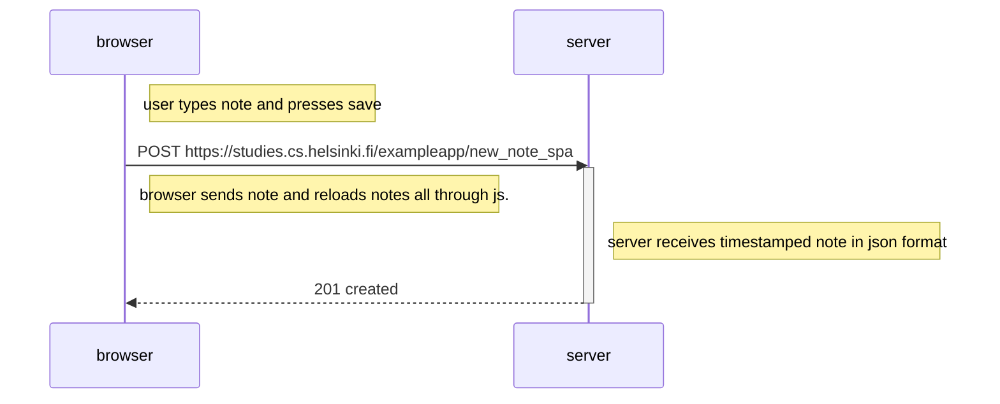

```mermaid
sequenceDiagram
    participant browser
    participant server

    note right of browser: user types note and presses save
    browser->>server: POST https://studies.cs.helsinki.fi/exampleapp/new_note_spa
    activate server
    note right of browser: browser sends note and reloads notes all through js.
    note right of server: server receives timestamped note in json format
    server-->>browser: 201 created
    deactivate server
```